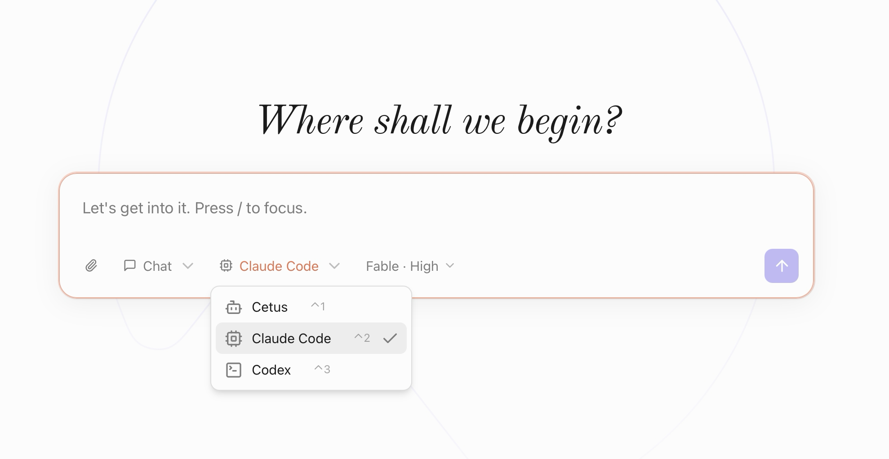

<p align="center"></p>

<h1 align="center">Cetus</h1>

<p align="center"><strong>The open-source macOS control plane for Codex, Claude Code, and persistent AI agents.</strong></p>

<p align="center">Run agents with optional worktree isolation, schedule background jobs, and review results on a single Kanban board — with the context and memory to keep work moving across sessions.</p>

<p align="center">
  <a href="https://github.com/drewnekota/cetus/releases/latest"></a>
</p>

<p align="center">
  <a href="https://github.com/drewnekota/cetus/releases/latest"></a>
  <a href="https://github.com/drewnekota/cetus/stargazers"></a>
  <a href="LICENSE"></a>
</p>

<p align="center"><strong>English</strong> · <a href="./README.zh-CN.md">简体中文</a></p>



## Why developers use Cetus

- **One home for your agents.** Switch any conversation between Cetus's built-in runtime, Claude Code, and Codex without losing the desktop workflow around it.
- **Safe, parallel coding sessions.** Enable per-conversation git worktrees when you want agents to edit in isolation instead of touching the current checkout.
- **Background work you can review.** Schedule a task, leave it running, and find the result waiting in **Needs review** instead of buried in a terminal session.
- **Context that survives the chat.** Workspaces, durable notes, meeting memory, and optional on-device screen context help the next run pick up where the last one stopped.
- **Local control.** Cetus is a native macOS app. Screen OCR, meeting transcription, and voice dictation run on-device; sensitive capabilities are opt-in.

## Get started

The prebuilt app supports **Apple Silicon** and **macOS 13 or later**.

1. [Download the latest release](https://github.com/drewnekota/cetus/releases/latest).
2. Open the DMG and move Cetus to Applications.
3. Use the built-in Cetus runtime, or select an already installed and signed-in `claude` or `codex` CLI.
4. Choose a workspace and give the agent its first task.

Claude Code and Codex reuse their existing CLI login — there is no second account to configure. Building from source is documented under [Development](#development).

> **Early release:** Cetus is under active development. Please [open an issue](https://github.com/drewnekota/cetus/issues) if something breaks or if a workflow is missing.

## Put agents to work

### Run Codex and Claude Code side by side

Pick a **workspace**, choose a runtime, optionally attach files or a screenshot, and send. Replies stream live with collapsible thinking blocks and tool-use cards. For parallel coding tasks, enable worktree isolation so each CLI conversation edits a separate checkout.


### Pick the right runtime for each job

**Cetus** uses the bundled pi harness. Switch a conversation to **Claude Code** or **Codex** to run it on the corresponding vendor CLI, with per-conversation model and reasoning-effort overrides.

The CLI runtimes reuse whatever `claude` / `codex` you already have installed and logged in on your `PATH` — no separate sign-in. Cetus keeps a conversation-scoped runtime alive (`claude -p` in streaming-input mode / `codex app-server`), translates its structured event stream into the same chat UI (text, thinking, tool cards), and preserves background terminals such as local dev servers across replies. Context and process cleanup follow the conversation lifecycle, and edits can be isolated in a per-conversation **git worktree**. Automations can fire on any runtime, so a scheduled job can run on Claude Code while your chats stay on Cetus.

### Send work to the background

Every conversation is a card tracked across **In progress · Needs review · Done**, filtered by workspace or across all of them. Background runs (automations, parallel solutions) surface here, so work that spans multiple sessions doesn't get buried in a chat list.


### Schedule recurring agents

Saved prompts that fire on a schedule (`at` / `every` / `cron` / `daily`). Each run starts a fresh background conversation — e.g. a weekday-09:00 news digest that searches the last 24 hours and renders an HTML summary while you're away.


### Bring the current screen with you

A global **double-⌘** panel: ask Cetus anything without leaving the app you're in. It reads what's in front of you and attaches it as removable context chips: a screenshot of your screen, the active app, the current browser URL, and any selected text. Keep what's useful, drop the rest, then start a new run or continue the last one.


## More than a coding-agent shell

- **Persistent memory** you and the agent both edit, injected into future turns
- **Parallel solutions**: fan one prompt into N candidate runs, then keep one and archive the rest
- **Ultra Code** mode: author a workflow and orchestrate sub-agents for a single request
- **Voice dictation** (on-device, macOS) — in-app and as a global push-to-talk
- **Meeting memory** (on-device, macOS) — auto-detect, system-audio capture, DeepSeek-distilled minutes the agent can search
- **Computer and browser control** through structured accessibility elements, with confirmation before consequential actions
- **30+ model providers under the hood**, including Anthropic, OpenAI, Google, Bedrock, Ollama, LM Studio, OpenRouter, and OpenAI-compatible endpoints

### Dictate from any app

Hold a hotkey from any app and talk — Cetus pops a floating equalizer HUD, transcribes on-device with Seed-ASR, and drops the cleaned-up text wherever your cursor is. The same stack as the in-app mic, but it follows you across the desktop.


### Turn meetings into searchable context

Turn on **meeting memory** and Cetus quietly transcribes your calls into searchable notes — on-device, text only, no audio stored.

- **Auto-detect** — when another app grabs your mic (Zoom, Teams, FaceTime, Feishu…), Cetus starts a session and stops when the call ends. Nothing to press.
- **Manual** — global hotkey (default **⌘⇧M**) for in-person meetings that auto-detect can't pick up.
- **Both sides** — your mic is you; system audio is everyone else, captured separately so the transcript knows who said what (macOS 14.2+; falls back to mic-only below that).

Transcription is 100% on-device via Apple's Speech framework — streaming, punctuated, segmented on natural pauses. While a session is live, a small floating pill (red dot + elapsed timer + stop button) sits at the top of your screen without stealing focus. When the call ends, one DeepSeek V4.1 Pro pass distills a title and clean markdown **minutes** — key points, decisions, action items.

Those notes become context the agent can reach: ask "what did we decide about the launch date?" and Cetus searches your meeting history (`search_meeting_history`) — all local, nothing uploaded. Off by default; the master switch means Cetus never listens until you opt in. macOS only for now.


### Remember what was on your screen

With screen context on, Cetus periodically captures frames, dedupes them with a perceptual hash, and OCRs on-device with Apple Vision so the agent can recall what you were working on — and you can search by OCR text or app. Images and text stay on your Mac; nothing is uploaded. Off by default; controls include capture interval, retention period, and an excluded-apps list that pauses capture when sensitive apps (1Password, Messages…) are frontmost.


### Stay in control

Each capability is opt-in. **Computer & Browser control** lets the agent drive your browser and Mac apps through numbered element lists (not raw pixels), with a confirmation step before anything consequential (sending, deleting, purchasing, submitting, authenticating) and a Stop button always in reach.


## Why Cetus

Terminal agents are excellent at individual tasks, but long-running work is easy to lose across sessions, repositories, and background processes. Cetus turns each run into a visible work item with a workspace, state, history, and review step.

A useful agent needs **context** about your situation, **intelligence** from the right model, and **abilities** to act. Cetus keeps those pieces independent: choose the runtime for each task, add only the context you want, and make the resulting work inspectable.

That makes workflows practical that do not fit neatly into a terminal tab:

- Run an agent while you are away and review the result later.
- Compare independent solutions without colliding git changes.
- Carry project decisions and preferences into the next conversation.
- Connect coding work to the meetings, screens, and apps surrounding it.

### Memory and Dreaming

The three factors describe a single moment. What makes an agent useful over time is whether it accumulates anything.


- **Memory** is context the agent writes back to itself — so the next session picks up where the last one left off instead of starting from scratch.
- **Dreaming** runs while you're idle: Cetus reflects on recent conversations and consolidates them into durable notes, turning raw history into preferences that persist. On by default.

## Development

### Requirements

- **Node** ≥ 20, **pnpm**, **bun** (for building the pi sidecar binary)
- **Rust** stable (`rustc`, `cargo`)
- **Tauri** prerequisites: <https://v2.tauri.app/start/prerequisites/>
- A **`DEEPSEEK_API_KEY`** (or your provider of choice; pi auto-picks up `ANTHROPIC_API_KEY`, `OPENAI_API_KEY`, etc.)
- **Optional**: the **Claude Code** (`claude`) and/or **Codex** (`codex`) CLIs installed and logged in, if you want them as conversation runtimes — Cetus reuses their existing login, no extra setup

### First-time setup

```bash
pnpm install
# Build pi as a single-file binary into src-tauri/binaries/pi-<target>.
# Takes ~30s. Run once per dev machine; binaries are gitignored.
./scripts/build-pi-sidecar.sh
```

### Run in dev

```bash
export DEEPSEEK_API_KEY=sk-...
pnpm tauri dev
```

Tauri launches the Next.js dev server (port 3000) and a window pointing at it. The pi sidecar is spawned automatically from the bundled binary.

#### Dev backdoor: `PI_BIN`

If you're iterating on pi itself, point at any pi build to bypass the sidecar:

```bash
export PI_BIN=/absolute/path/to/your/pi
pnpm tauri dev
```

This skips `tauri-plugin-shell` entirely and uses raw `tokio::process::Command`.

### Build

```bash
./scripts/build-pi-sidecar.sh   # if you haven't already
pnpm tauri build
```

Outputs `.app` / `.dmg` on macOS. A real multi-size icon set is required for `tauri build` (lives under `src-tauri/icons/`, regenerate with `pnpm tauri icon <path-to-1024px.png>`).

## Architecture

```
┌──────────────────────────────── Tauri window ──────────────────────────────────┐
│                                                                                │
│  Next.js (static export)              Rust (Tokio + tauri-plugin-shell)        │
│  ┌─────────────────────────┐          ┌──────────────────────────────────────┐ │
│  │ React UI                │  invoke  │  Tauri commands                      │ │
│  │ - ConversationList      │ ───────► │  (list, new, switch, send,           │ │
│  │ - Chat (text/thinking/  │          │   archive, set_model,                │ │
│  │   tool cards), Composer │ ◄─────── │   extension_ui_respond, …)           │ │
│  │ - ModelPicker (DeepSeek)│  event   │                                      │ │
│  │ - DialogHost (ext UI)   │          │  PiRpc: sidecar(plugin-shell) OR     │ │
│  │ - chatReducer (deltas → │          │    PI_BIN(tokio::process)            │ │
│  │   RenderedMessage[])    │          │  Store: SQLite metadata              │ │
│  └─────────────────────────┘          └─────────────────┬────────────────────┘ │
│                                                         │ stdin/stdout         │
│                                                         ▼ (LF-framed JSON)     │
│                                       ┌──────────────────────────────────────┐ │
│                                       │  pi --mode rpc subprocess            │ │
│                                       │  (bundled binary, any-model engine)  │ │
│                                       └──────────────────────────────────────┘ │
└────────────────────────────────────────────────────────────────────────────────┘
```

- **Conversations** are pi `.jsonl` session files under `<app-data>/sessions/`. We index them (id, title, session_file, model, timestamps, archived_at) in SQLite at `<app-data>/cetus.db`.
- **Switching**: `switch_session` + `get_messages` replays history. One pi process for the app lifetime.
- **Streaming**: pi emits `agent_start`, `message_update` with `assistantMessageEvent` deltas, and `tool_execution_*` events. The frontend `chatReducer` folds these into stable `RenderedMessage[]` indexed by `contentIndex`, with a `toolCallId → block` side-table to route execution updates.
- **Framing**: strict-LF JSONL. `tauri-plugin-shell` delivers stdout in arbitrary byte chunks, so the reader maintains its own accumulator and emits one line per `\n`, stripping optional `\r`. Generic line readers that split on Unicode separators (Node `readline`) are non-compliant.
- **Sidecar packaging**: `src-tauri/binaries/pi-<target>` ships inside `.app/Contents/Resources/`. `PI_BIN` env var is the dev backdoor for iterating on pi.
- **CLI runtimes**: conversations on **Claude Code** / **Codex** bypass the pi RPC entirely — `cetus-bridge::cli_agent` keeps a conversation-scoped Claude streaming session or Codex app-server thread alive, and a unit-tested `EventTranslator` maps their events into the same PiEvent stream `chatReducer` already consumes. Context and background terminals persist across turns via the vendor session/thread; optional per-conversation git worktrees isolate edits.
- **Extension UI**: when a pi extension calls `ctx.ui.select()` etc., pi sends `extension_ui_request` over the event stream. The frontend `DialogHost` renders a dialog and replies via the `extension_ui_respond` Tauri command.
- **Bridge**: Cetus also intercepts known extension host tunnels and routes them to native handlers. See [docs/bridge.md](docs/bridge.md) for the protocol, security boundary, and open-source extraction plan.

## Reusable bridge packages

The host/extension bridge is factored into two standalone, provider-neutral packages you can depend on without pulling in the rest of the app:

- **[`cetus-bridge`](src-tauri/cetus-bridge)** (Rust crate) — the product-light host runtime: JSONL subprocess RPC around `pi --mode rpc`, deterministic extension loading, host-tunnel classification, and injectable `EventSink` / `TaskSpawner` traits. Tauri, app storage, and model-provider choices stay out of the crate — they live in app-side adapters (`tauri_bridge.rs`, `app_event.rs`, `model_bridge.rs`). `examples/minimal_host.rs` shows the smallest integration.
- **[`@cetus/bridge-protocol`](packages/cetus-bridge-protocol)** (TypeScript) — the extension-side protocol: the shared `HOST_TUNNELS` sentinels, `callHost()`, `toolResult()`, and host-tunnel types.

Both are MIT-licensed and carry no Cetus- or DeepSeek-specific code, so other agent hosts can reuse the same bridge. See [docs/bridge.md](docs/bridge.md) for the protocol and security boundary.

## License

MIT (matches pi).
