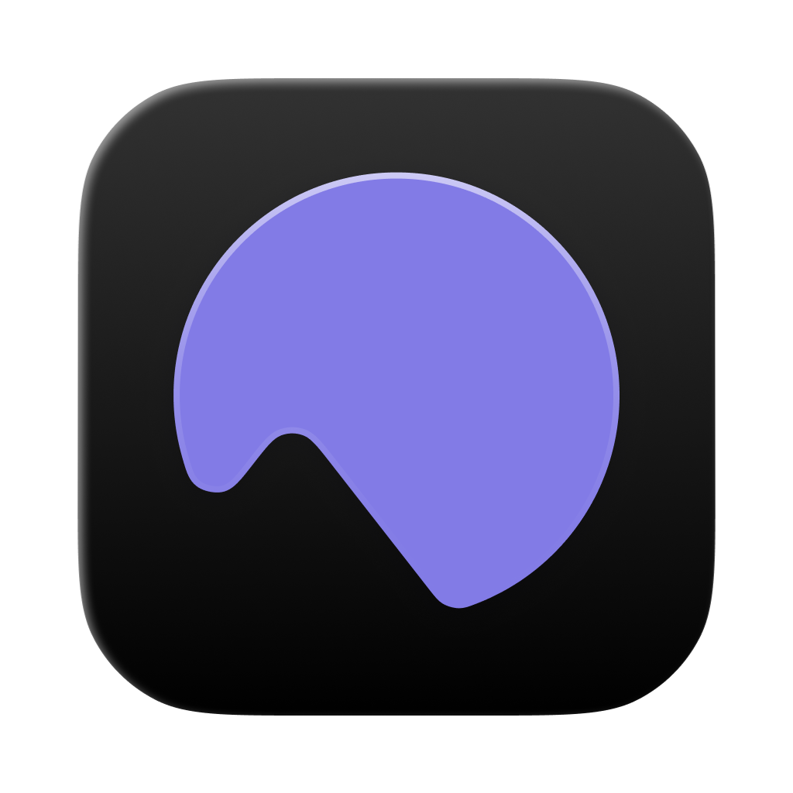
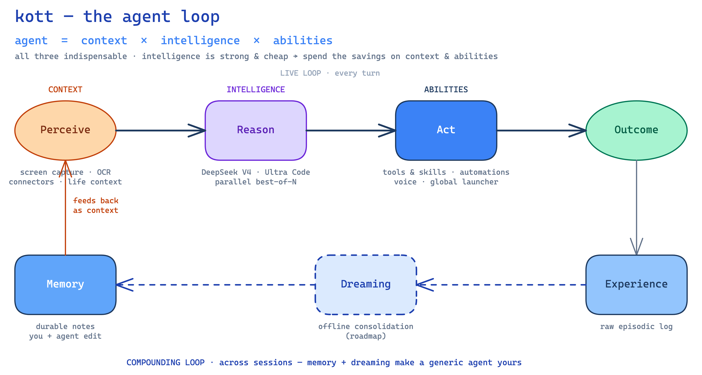
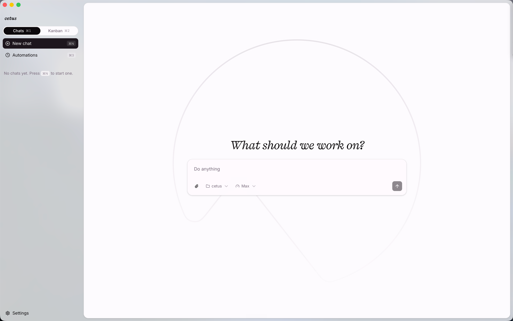
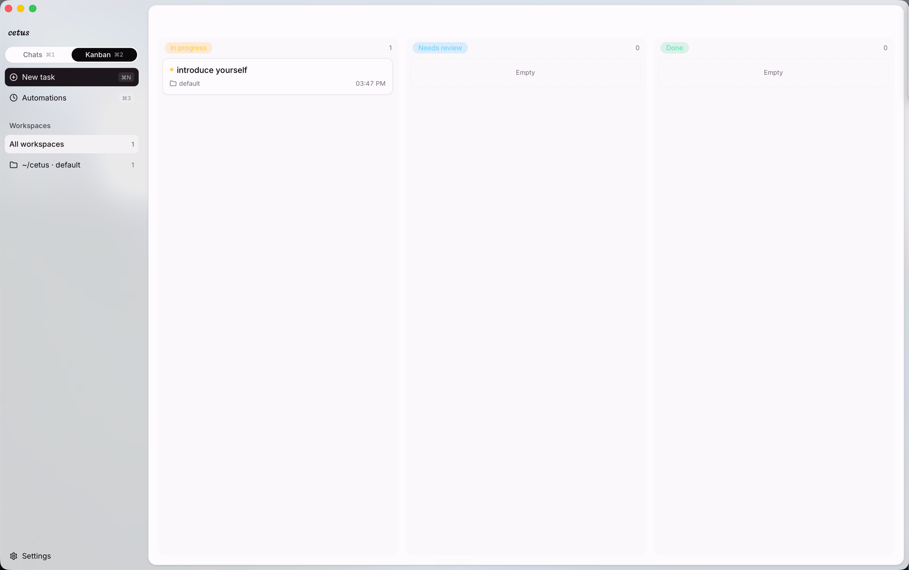
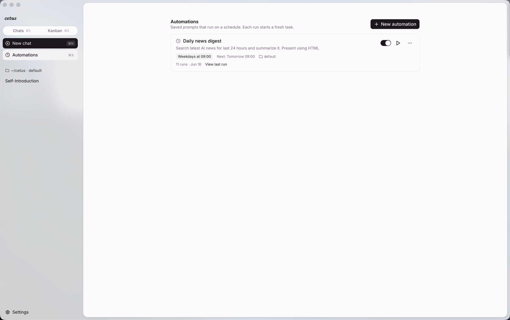
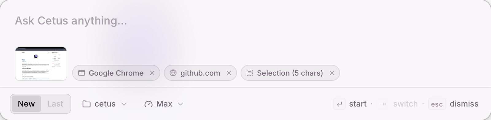
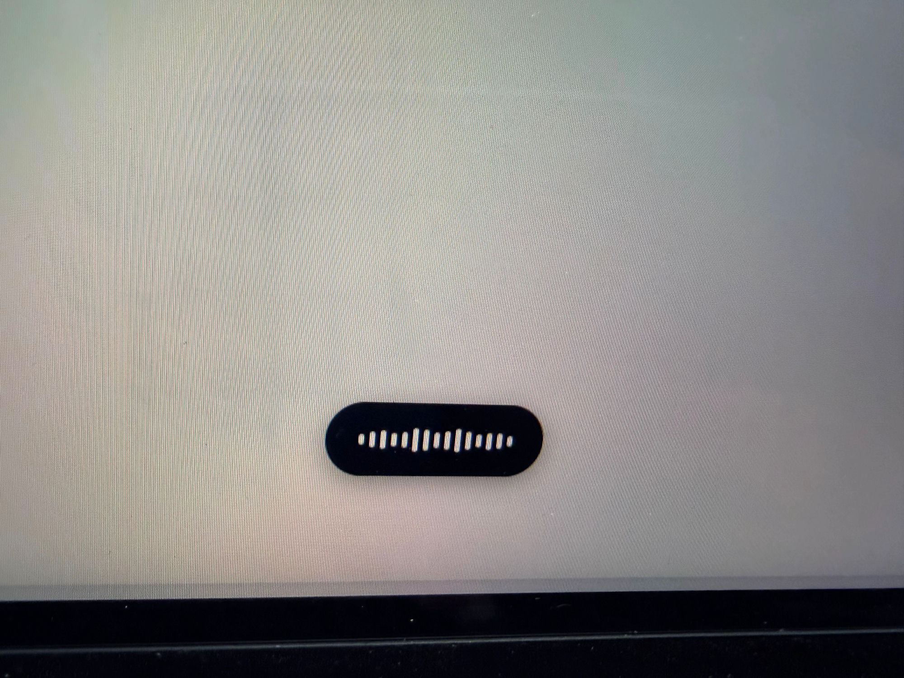
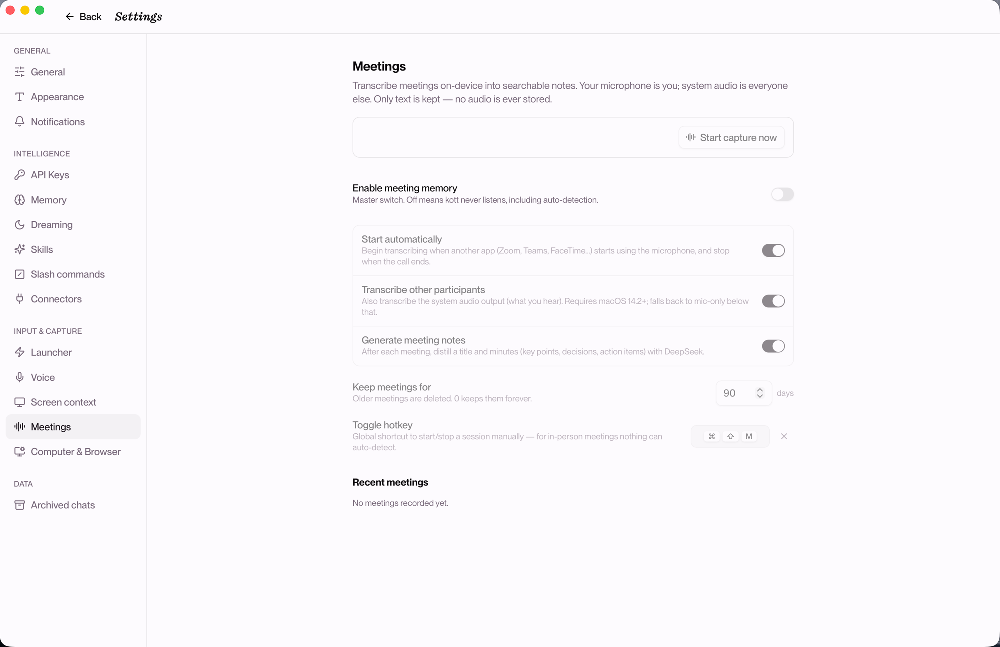
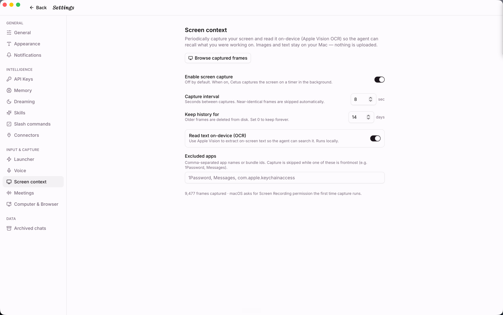
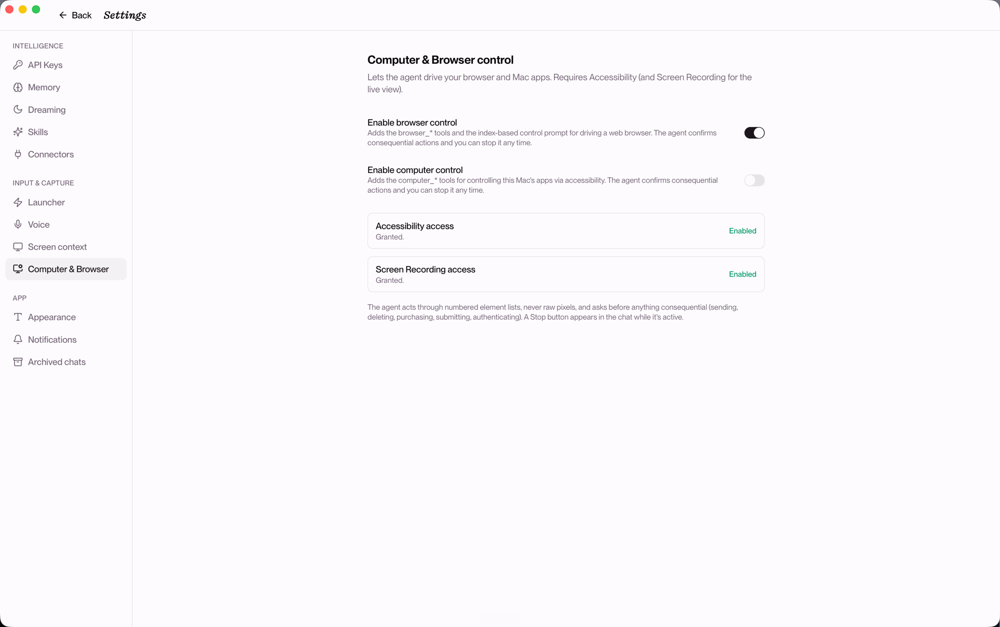

<p align="center"></p>

# Cetus

[English](./README.md) · **简体中文**

一个 macOS 桌面 agent，基于 DeepSeek V4.1。它能看见你的屏幕、记住要紧的事，也能替你动手 —— 便宜到可以整天开着陪你跑。

---

## 为什么做 Cetus

大多数 AI 助手每次对话都从空白开始。推理能力不错，但它们不知道你在做什么，能做的也基本只是聊聊天。

一个真正有用的 agent 需要三样东西：**context**（了解你的处境）、**intelligence**（推理能力）和 **abilities**（能实际做哪些事）。很长一段时间里，智力是瓶颈。现在不是了 —— 现代模型已经够好，DeepSeek V4.1 又把价格打下来了。这件事改变了什么值得去做。

当 token 便宜一个数量级，很多以前做不起的事就变得可行：

- 持续截取屏幕并做 OCR，以便日后回溯
- 对同一个任务并行跑 N 次、取最好的结果
- 定时调度 agent，在你离开时自己干活
- 让一个 agent 为单次请求编排子 agent

Cetus 把这省下来的钱花在大多数 agent 欠缺的地方：给 agent 更厚的 context，以及更多真正能动手的能力。

### Memory 与 Dreaming

上面三样东西描述的是某一个时刻。让 agent 跨时间真正有用的，是它能不能积累什么。



- **Memory（记忆）** 是 agent 写回给自己的 context —— 下一个 session 从上次停下的地方继续，而不是从零开始。
- **Dreaming（做梦）** 在你闲着的时候跑：Cetus 回顾最近的对话，把它们整合成持久的笔记，让原始聊天记录沉淀为可以复用的偏好。默认开启。

## app 里有什么

| | Cetus 现在 |
| --- | --- |
| **Context** | Rewind 式屏幕截取 + 设备端 Apple Vision OCR（默认关闭）· **会议记忆** —— 设备端转写通话，生成可搜索的纪要 · **带上下文的启动器**，自动附上截图、当前 app、浏览器 URL 与选中文本 · 通过 pi connectors 接入第三方数据 |
| **Intelligence** | DeepSeek **V4.1 Flash** ⚡ / **V4.1 Pro** ✨ · pi harness · **Ultra Code** 模式（agent 自己编写 workflow 并编排子 agent）· **并行解法**（best-of-N 并行跑 + 并排对比挑选） |
| **Abilities** | pi 的 tools 与 skills · 30+ 模型供应商及任意 OpenAI 兼容端点 · 定时**自动化任务**，在后台开出新对话 · 设备端**语音听写** · 全局双击 ⌘ **启动器** |
| **Memory** | 持久笔记（身份、偏好、进行中的项目），你和 agent 都能编辑，每一轮都注入 · **Dreaming**：空闲时离线整合（默认开启） |

## 界面一览

### 对话

一个输入框搞定一切：选 **workspace**（工作目录）、选 **preset**（Daily ⚡ / High / Max / UltraCode ✨）、可选附上文件或截图，然后发出去。回复实时流式，带可折叠的 **thinking** 块和 **tool use** 卡片（参数、结果、错误高亮）。



### 看板

每个对话都是一张卡片，按**进行中 · 待审阅 · 已完成**跟踪，可按 workspace 筛选或查看全部。后台运行（自动化任务、并行解法）都会落在这里，让跨越多次坐下才完成的工作不会淹没在聊天列表里。



### 自动化任务

按计划触发（`at` / `every` / `cron` / `daily`）的保存 prompt。每次触发都会开出一个全新的后台对话 —— 比如工作日 09:00 的 Daily news digest，在你不在时搜索过去 24 小时的新闻并渲染成 HTML 摘要。



### 快捷启动器

全局**双击 ⌘** 唤出的磨砂面板：不离开当前 app，就能直接向 Cetus 提问。它读取你眼前的内容，以可移除标签的形式附上：屏幕截图、当前 app、浏览器 URL、以及选中的文本。留下有用的、去掉多余的，然后开启新对话或接续上一次。



### 语音输入

在任意 app 里按住热键开口说话 —— Cetus 弹出一个随声音起伏的悬浮均衡器 HUD，在设备端用 Seed-ASR 转写，并把整理好的文字落到你光标所在的位置。和 app 内麦克风用同一套管线，只不过它跟着你跑遍整个桌面。



> 📸 没错，这是一张用手机拍屏幕的照片。这个 HUD 是无边框永远置顶的悬浮层，把我试过的每个截图工具都躲开了，只好举起相机对着显示器拍。😄

### 会议记忆

打开**会议记忆**，Cetus 会安静地把通话转写成可搜索的纪要 —— 全程设备端、只存文字、不保存音频。

- **自动识别** —— 当别的 app 占用麦克风（Zoom、Teams、FaceTime、飞书……），Cetus 自己开始会话，通话结束时停止。什么都不用按。
- **手动** —— 全局热键（默认 **⌘⇧M**）手动开关，用于无法被自动识别的线下面对面会议。
- **对话双方都收录** —— 你的麦克风是你；系统音频是其他所有人，分轨采集，纪要知道每句话是谁说的（需 macOS 14.2+；更低版本回退为仅麦克风）。

转写 100% 在设备端完成，走 Apple 的 Speech 框架，流式、带标点、在自然停顿处分段。会话进行中，屏幕顶部浮出一个小药丸（红点 + 计时 + 停止按钮），不抢焦点。会议结束后，一次 DeepSeek V4.1 Pro 调用把转写蒸馏成标题和 markdown **纪要** —— 要点、决议、待办事项。

这些纪要会成为 agent 能触达的 context：直接问"我们关于上线日期定了什么？"，Cetus 就会检索会议历史（`search_meeting_history`）—— 全部来自本地日志，没有东西离开这台机器。默认关闭；总开关意味着在你显式开启前，Cetus 绝不监听。目前仅支持 macOS。



### 屏幕 context

开启后，Cetus 周期性截帧、用感知哈希去重，并在设备端用 Apple Vision 做 OCR —— agent 可以回忆起你当时在做什么，你也能按 OCR 文本或 app 搜索这段历史。图像和文本都留在你的 Mac 上，不上传。默认关闭；控制项包括截取间隔、历史保留时长，以及一份排除 app 列表 —— 1Password、Messages 这类敏感 app 处于前台时自动暂停截取。



### 设置

每项能力都是显式开启的。**Computer & Browser control** 让 agent 通过编号的元素列表（而非原始像素）驱动你的浏览器和 Mac app，在任何有后果的操作（发送、删除、购买、提交、认证）前需要确认，Stop 按钮始终触手可及。



## 还有这些

- **持久记忆**：用户和 agent 都能编辑，每一轮都注入（身份、偏好、进行中的项目）
- **并行解法**：把一个 prompt 铺开成 N 个候选运行，然后留一个、归档其余
- **Ultra Code** 模式：agent 为单次请求派生自己的子 agent
- **语音听写**（设备端，macOS）：在 app 内可用，也支持全局按住说话
- **会议记忆**（设备端，macOS）：自动识别、系统音频采集、DeepSeek 蒸馏的纪要，agent 可检索
- 新建 / 切换 / 重命名 / 归档 / 删除对话（元数据存于 SQLite）
- 中断进行中的运行 · 通过 `switch_session` 在多对话间共享同一个 pi RPC 子进程
- pi 二进制以 Tauri sidecar 形式打包，终端用户无需依赖 PATH
- **底层 any-model**：pi 支持 30+ 供应商（Anthropic、OpenAI、Google、Bedrock、Ollama、LM Studio、OpenRouter…）及任意 OpenAI 兼容端点；当前 UI 仅暴露 DeepSeek，改 `model-picker.tsx` 里一行即可切换

## 环境要求

- **Node** ≥ 20、**pnpm**、**bun**（用于构建 pi sidecar 二进制）
- **Rust** stable（`rustc`、`cargo`）
- **Tauri** 前置依赖：<https://v2.tauri.app/start/prerequisites/>
- 一个 **`DEEPSEEK_API_KEY`**（或你选用的供应商；pi 会自动读取 `ANTHROPIC_API_KEY`、`OPENAI_API_KEY` 等）

## 首次配置

```bash
pnpm install
# 把 pi 构建为单文件二进制，输出到 src-tauri/binaries/pi-<target>。
# 约 30 秒。每台开发机跑一次即可；二进制已被 gitignore。
./scripts/build-pi-sidecar.sh
```

## 开发运行

```bash
export DEEPSEEK_API_KEY=sk-...
pnpm tauri dev
```

Tauri 会启动 Next.js 开发服务器（端口 3000）并打开一个指向它的窗口。pi sidecar 会从打包好的二进制自动派生。

### 开发后门：`PI_BIN`

如果你在迭代 pi 本身，可以指向任意 pi 构建来绕过 sidecar：

```bash
export PI_BIN=/absolute/path/to/your/pi
pnpm tauri dev
```

这会完全跳过 `tauri-plugin-shell`，改用原始的 `tokio::process::Command`。

## 构建

```bash
./scripts/build-pi-sidecar.sh   # 如果还没跑过
pnpm tauri build
```

在 macOS 上输出 `.app` / `.dmg`。`tauri build` 需要一套完整的多尺寸图标（存于 `src-tauri/icons/`，用 `pnpm tauri icon <path-to-1024px.png>` 重新生成）。

## 架构

```
┌──────────────────────────────── Tauri window ──────────────────────────────────┐
│                                                                                │
│  Next.js (static export)              Rust (Tokio + tauri-plugin-shell)        │
│  ┌─────────────────────────┐          ┌──────────────────────────────────────┐ │
│  │ React UI                │  invoke  │  Tauri commands                      │ │
│  │ - ConversationList      │ ───────► │  (list, new, switch, send,           │ │
│  │ - Chat (text/thinking/  │          │   archive, set_model,                │ │
│  │   tool cards), Composer │ ◄─────── │   extension_ui_respond, …)           │ │
│  │ - ModelPicker (DeepSeek)│  event   │                                      │ │
│  │ - DialogHost (ext UI)   │          │  PiRpc: sidecar(plugin-shell) OR     │ │
│  │ - chatReducer (deltas → │          │    PI_BIN(tokio::process)            │ │
│  │   RenderedMessage[])    │          │  Store: SQLite metadata              │ │
│  └─────────────────────────┘          └─────────────────┬────────────────────┘ │
│                                                         │ stdin/stdout         │
│                                                         ▼ (LF-framed JSON)     │
│                                       ┌──────────────────────────────────────┐ │
│                                       │  pi --mode rpc subprocess            │ │
│                                       │  (bundled binary, any-model engine)  │ │
│                                       └──────────────────────────────────────┘ │
└────────────────────────────────────────────────────────────────────────────────┘
```

- **对话** 是 `<app-data>/sessions/` 下的 pi `.jsonl` session 文件。我们在 `<app-data>/cetus.db` 的 SQLite 里为它们建索引（id、title、session_file、model、时间戳、archived_at）。
- **切换**：`switch_session` + `get_messages` 重放历史。整个 app 生命周期里只有一个 pi 进程。
- **流式**：pi 发出 `agent_start`、带 `assistantMessageEvent` 增量的 `message_update`，以及 `tool_execution_*` 事件。前端的 `chatReducer` 把这些折叠成按 `contentIndex` 索引的稳定 `RenderedMessage[]`，并用一张 `toolCallId → block` 旁表来路由执行更新。
- **分帧**：严格 LF 的 JSONL。`tauri-plugin-shell` 以任意字节块投递 stdout，所以读取端维护自己的累加缓冲，按每个 `\n` 吐出一行，并剥掉可选的 `\r`。按 Unicode 分隔符切分的通用行读取器（Node `readline`）不符合规范。
- **Sidecar 打包**：`src-tauri/binaries/pi-<target>` 打进 `.app/Contents/Resources/`。`PI_BIN` 环境变量是迭代 pi 的开发后门。
- **Extension UI**：当某个 pi extension 调用 `ctx.ui.select()` 等，pi 会通过事件流发出 `extension_ui_request`。前端 `DialogHost` 渲染一个对话框，并通过 `extension_ui_respond` Tauri 命令回复。

## 可复用的 bridge 包

host/extension bridge 被拆成了两个独立、与具体 provider 无关的包，可以单独依赖，无需引入整个 app：

- **[`cetus-bridge`](src-tauri/cetus-bridge)**（Rust crate）—— 产品无关的 host 运行时：围绕 `pi --mode rpc` 的 JSONL 子进程 RPC、确定性的 extension 加载、host tunnel 分类，以及可注入的 `EventSink` / `TaskSpawner` trait。Tauri、app 存储、模型 provider 选择都留在 crate 之外，由 app 侧适配器承接（`tauri_bridge.rs`、`app_event.rs`、`model_bridge.rs`）。`examples/minimal_host.rs` 给出了最小集成示例。
- **[`@cetus/bridge-protocol`](packages/cetus-bridge-protocol)**（TypeScript）—— extension 侧协议：共享的 `HOST_TUNNELS` 哨兵列表、`callHost()`、`toolResult()`，以及 host tunnel 的类型定义。

两个包都是 MIT 协议，且不含任何 Cetus / DeepSeek 专属代码，其他 agent host 也可以复用同一套 bridge。协议与安全边界详见 [docs/bridge.md](docs/bridge.md)。

## 许可证

MIT（与 pi 一致）。
